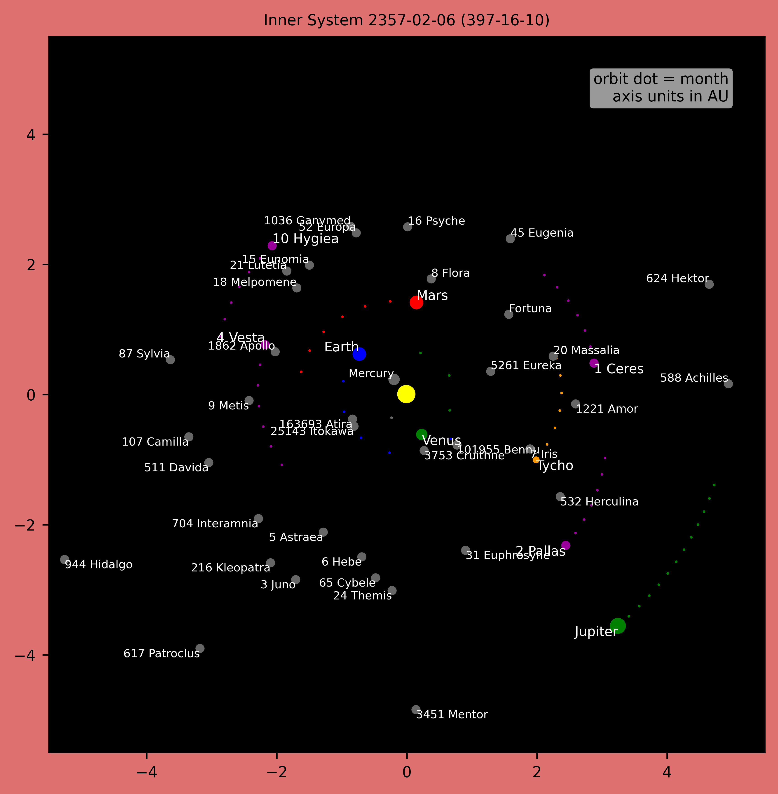
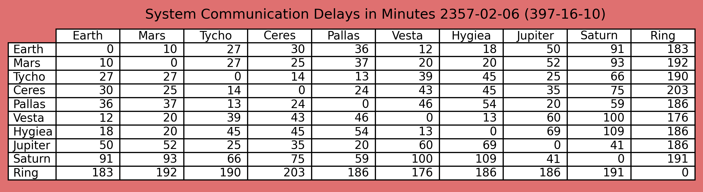
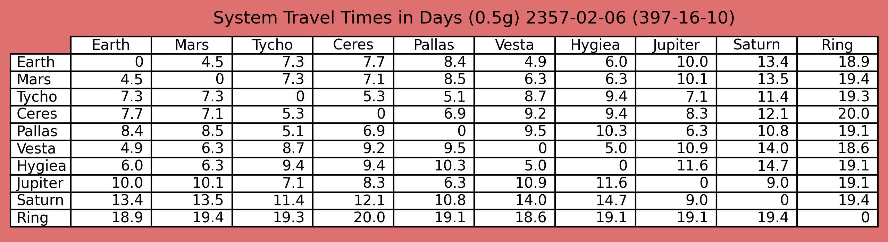
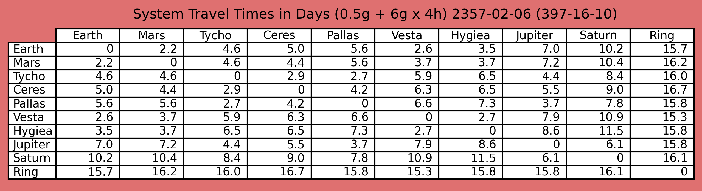

# Background

There is a very good reason why every fantasy world should have a map. If in a modern day thriller somebody in Paris says that "Let's go to Tokyo", we all have some idea what that would mean. We know where to head and how much gear to pack. Kind of mental subway map.

The fantasy world of The Expanse doesn't have a map. Yes, we have familiar names like Mars and Jupiter, but no real information where they are or even how far apart they are. Alex makes a call to Bobbie while flying by Mars. It's a short call because of Rocinante's high speed at that moment. Very cool indeed, but the orbital position of Mars must have been in the route of Rocinante towards outer planets. How convenient.

Planets and asteroids really don't exist all over their orbits like described in the RPG rulebook. They have their own constantly changing locations around the Sun. Miller does a quite remarkably orbital detective work when tracking down the location of Scopuli. In the universe of The Expanse, this kind of newtonian knowledge should be as common as ideas of north and east are for us earthers.

# Calendars

Standard Earth time is used almost everywhere. Most of the humanity lives on Earth, space habitats have no natural days and human biology is still accustomed to 24-hour sleep cycle. Belters may don't like it, but there are no real reasons to invent new timekeeping conventions. However, weeks and weekdays are mostly forgotten.

Notable exception is Mars, where the day-to-day living is based on natural solar day called simply sol. They use standard hours and minutes, but add 37 minute and 22 second period after midnight to match local sol. Different day length means also different calendar and 24-month Darian calendar is commonly used.

Other space habitats have their own baseline times, but these work just like time zones in Earth. For example, Luna uses New York time zone, because of resident UN offices and short enough communication delay.

Also, each longer spaceship journey either decides or automatically generates its own local time zone bubble. Sometimes longer or shorter day cycle is used to adjust between origin and destination times.

# Solar System Maps

Program uses real orbit data from NASA, but not real year 2350 locations. Some ephemerides files contain orbit data only until year 2050 and we have to cheat a little. Python script subtracts 330 years and uses locations starting from year 2020. This is quite acceptable for gaming purposes and especially for The Expanse, where actual dates are somewhat vague anyway.

Use of this data was just the easiest way to populate otherwise very empty space with real asteroids and moons without too much work. You may never visit 7066 Nessus, but its strange orbit alone makes outer planet map so much more interesting.

The most important thing here is that heavenly bodies move predictably during the campaign and their relative positions can be used as a plot point. Unfortunately, it also means that travel times and asteroid locations mentioned in some published adventures need adjustment. Communication delay and travel time tables in the rulebook are based on distances between orbits, not between actual objects. If two planets happen to be opposite sides of the Sun, the real distance is much longer.

Because, in addition to dates, The Expanse universe lacks lots of other technical details, some additional improvisation is needed.

For example, location and orbit of Tycho Brahe (asteroid 1677) is used for Tycho Station. Yes, Tycho Station has drives and can be moved, but that doesn't happen too often. Most of the time it just circles around the sun like any other asteroid.

Same goes with the destroyed Anderson Station. It is mentioned that it is located "at the far end of the colonized Belt, almost at the opposite side from the major port Ceres". Suitably located asteroid (127 Johanna) with more or less same orbital period is used for its position.

Sol Ring is another problem. It is said to be "stationary positioned little less than 2 AU outside the orbit of Uranus". That means about 22 AU from Sun to random direction. In Abaddon's Gate Holden says: "This is the Ring. And this is Uranus. They are literally the two spots furthest from each other in the universe that have humans near them". Uranus happens to be in the top right quadrant and that puts the Sol Ring to the bottom left quadrant in the outer planet map.

### Communication Delay and Travel Times

Communication delay is quite straightforward. Just the distance between objects divided by the speed of light. Delay between planet's moons is usually less than 10 seconds. Delay between Earth and Moon is about 1.3 seconds.

Simple travel profiles with constant acceleration do not always make sense. Faster one for generic passengers would be: initial high-g acceleration with the juice for a few hours, 0.5g cruise to a halfway point, 0.5g deceleration cruise and final high-g braking with the juice again. 0.5g is tolerable for belters and 4 hours is probably near the upper limit of a single acceleration period with the juice.

Technically it would be possible to have several boost periods during a long journey, but that is not implemented yet. Also, current scheme means that passengers arrive to the destination just after the braking boost with all annoying hangover effects. Optimal acceleration arrangement could be flip before midpoint and earlier boost deceleration with final cruise period before arriving to the destination. This slows down the journey a little, but allows recovery from juice before arrival. This also means that the travel time calculation becomes asymmetrical and much more complex.

Following example tables display travel times with and without the juice boost:

### Solar System Document

Most asteroid descriptions are taken from Wikipedia with some modifications. Unfortunately, we don't yet know much about them and their original decriptions are full of words like 'may be', 'estimated' or 'assumed'. I just edited those out and ended up with more or less credible sounding 'facts'.
